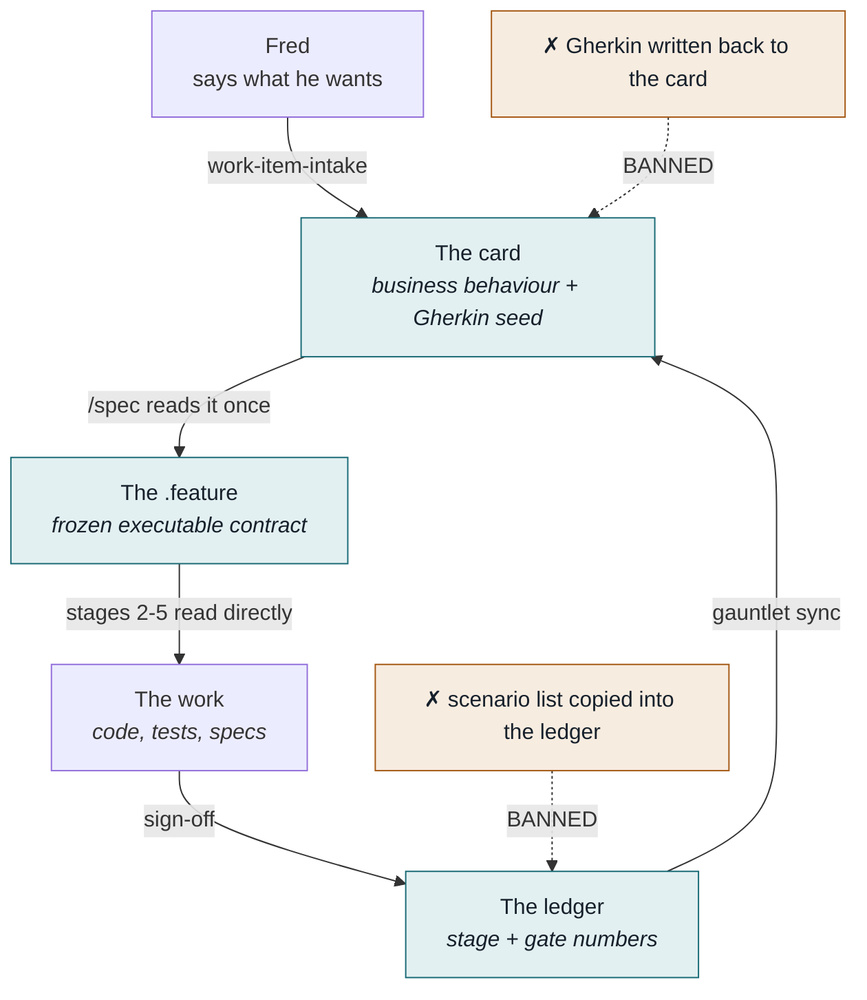
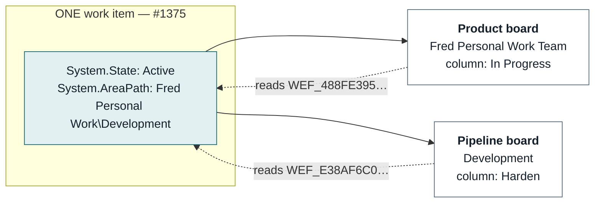
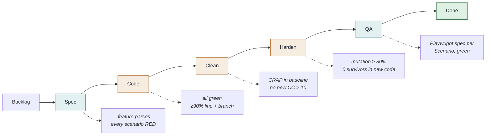
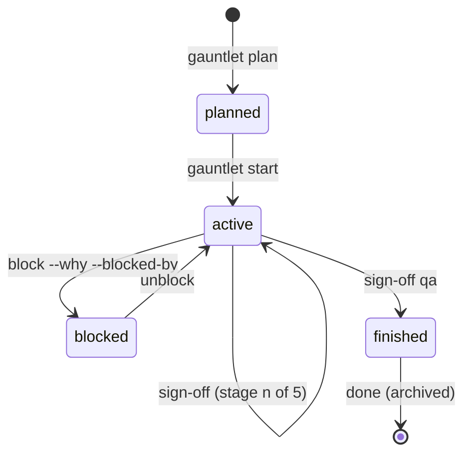
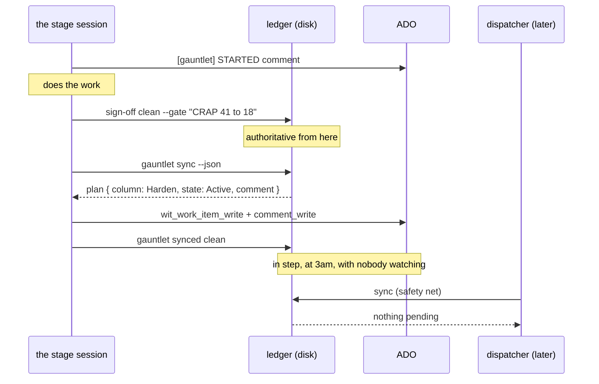
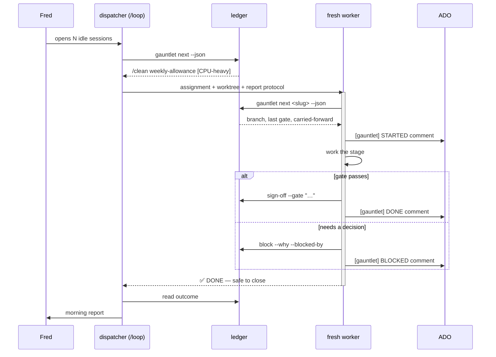
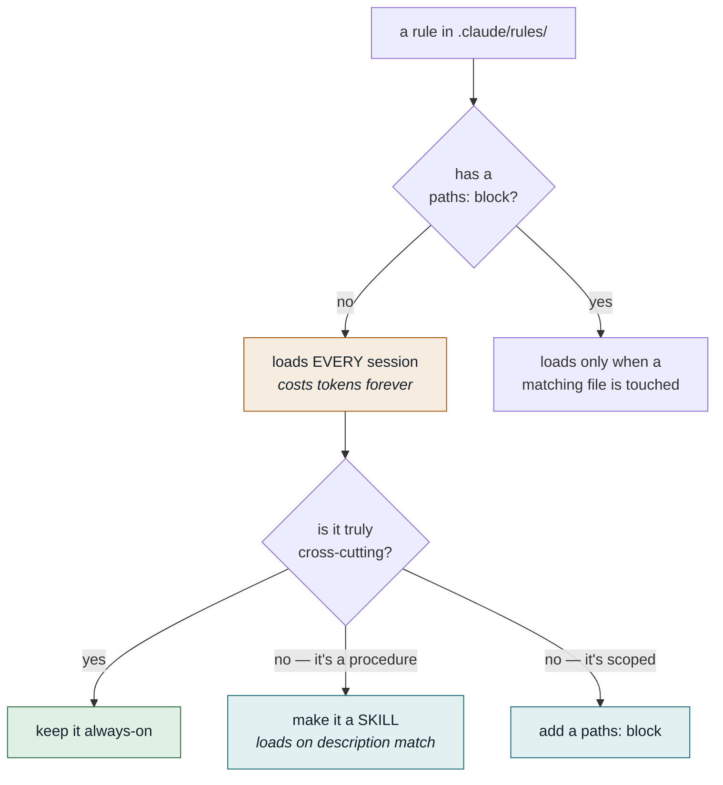
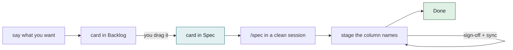

# The agent operating model

How work gets from "Fred wants a thing" to "verified, mutation-tested, on the board as Done" —
and what each agent is allowed to decide on the way.

Written 2026-09-11. This document is the reference; the enforcement lives in
[`.claude/rules/`](../.claude/rules/), [`.claude/commands/`](../.claude/commands/) and
[`tools/gauntlet.mjs`](../tools/gauntlet.mjs). Where this document and those disagree, they win
and this is stale — say so rather than following it.

---

## 1. The shape of it

Three artefacts, and keeping them distinct is the whole design:

| | Holds | Lives | Written by | Read by |
|---|---|---|---|---|
| **The card** | what the business wants, and why | ADO, both boards | Fred, via `work-item-intake` | `/spec` — once, then never again |
| **The `.feature`** | what must be *true* — the executable contract | the repo, frozen after `/spec` | `/spec`, once | stages 2–5, directly |
| **The ledger** | how far the work got, with what numbers | `~/gauntlet-state/`, outside the repo | every stage, on sign-off | every stage, at start |



Each answers a different question. The failure this codebase has already suffered **twice** is
letting two of them answer the *same* question — then they drift, and nobody knows which is true.
`docs/requirements/GLOBAL-EXECUTION-TRACKER.yaml` died that way and is still referenced by four
files that outlived it.

### The rule that prevents it: derive, don't store

| Value | Where it comes from | Never |
|---|---|---|
| scenario count | counted from the `.feature` at read time | stored in the ledger |
| green count | parsed from the newest acceptance `.trx` | self-reported by a stage |
| current stage | last sign-off in the ledger | inferred from the board |
| build scope | the `ProjectReference` graph, live | a hand-kept list |

The ledger holds **only** what genuinely cannot be computed: which stage signed off, when, the
gate numbers at that moment, what was carried forward, and whether it is blocked.

A `green` of `null` means **"no run on record"** — never "0 passing". Reporting the second when
the first is true is how a healthy feature gets declared broken.

---

## 2. Two boards, one set of work items

Same ADO project (`Fred Personal Work`), two teams, each with its own columns over the *same* items.

| Board | Team | Role | Columns |
|---|---|---|---|
| **Product** | `Fred Personal Work Team` | everything wanted, ever — the standing backlog | Backlog → Spec / Design → Ready for Dev → In Progress → Ready For Testing → Testing → Ready for Release → Done |
| **Pipeline** | `Development` | only what is being built right now | Backlog → Spec → Code → Clean → Harden → QA → Done |



One item, two column values, stored in two different fields. The state is shared; the columns are
not. That is why the business board can say "In Progress" for the whole of Code→Clean→Harden
while the pipeline board tracks each one.

**Two settings had to be fixed for this to be true:**

- `Fred Personal Work Team` area path is `Fred Personal Work` with **`includeChildren: true`**. With the ADO
  default of `false`, moving an item to `Fred Personal Work\Development` **removes it from the product
  board** rather than adding it to the pipeline board. It looks like the item was deleted.
- `Development` has `bugsBehavior: asRequirements`. The ADO default for a new team (`asTasks`)
  hides Bugs from the board entirely, so a bug pulled into the pipeline would be invisible.

### Pulling an item into the pipeline

Two writes, and they *are* the act of starting work:

```
System.AreaPath                                    -> Fred Personal Work\Development
WEF_E38AF6C093F34082A7A64C805E0B4089_Kanban.Column -> Spec    (User Story / Bug)
WEF_1D473EAF74AC4889A7290D6A94F049D6_Kanban.Column -> Spec    (Feature)
```

Then `gauntlet plan <slug> --title "…" --ado <id>` so the ledger holds the link.

The item **keeps its parent Feature/Epic**, so the product hierarchy is never broken by the move.

### The read-only field trap

`System.BoardColumn` is **read-only**. Writing it fails with
`TF401326: Invalid field status 'ReadOnly'`. The writable field is a per-board `WEF_…` field, and
**its GUID is not the board id** — the Development Stories board is `d0eccefd-6a96-…` but its
column field is `WEF_E38AF6C0…`. They are unrelated identifiers, so the field name cannot be
derived. Read it once from:

```
GET https://dev.azure.com/PeskySix/Fred Personal Work/{team}/_apis/work/boards/{board}?api-version=7.1
    -> fields.columnField.referenceName
```

Setting `System.State` alone is not enough either: Code, Clean and Harden all map to `Active`, so
a card with only its state set lands in the **leftmost** matching column — silently rewinding the
pipeline. Always write both the state and the column field.

### Editing board column definitions

PAT + REST (`$AZURE_DEVOPS_PAT`), `PUT .../boards/{board}/columns`, sending the **full** array.
Three constraints that are not in the obvious docs:

- The incoming and outgoing columns may be **renamed but not deleted and recreated** — reuse
  their existing `id`, or the API rejects with "You cannot delete and recreate incoming column."
- Neither incoming nor outgoing may carry a `description`.
- `bugsBehavior` must be set **before** the columns, or `Bug` is not a valid key in
  `stateMappings`.

---

## 3. What a card looks like

Filed by the `work-item-intake` skill, which asks the full intake battery **before anything is
created** and **always asks for priority rather than assuming it**.

### The battery

For a bug: where, what happened, what should have happened and why, who is hit, how often, since
when, what the damage is now, workaround, which environment, evidence, priority.

For an improvement: who benefits, how it works today, what should be possible afterwards, why
now, how we will know it worked, the business rules that matter, what is explicitly out of scope,
what must not change, where it belongs, priority.

**"Don't know" is a valid answer** and is recorded as **Not confirmed** — never as a guess.

### Priority is asked; severity is derived

| Priority — the requester's call, asked out loud every time | |
|---|---|
| 1 | most urgent — we drop things for it |
| 2 | important — this release |
| 3 | should happen — next release |
| 4 | not a big deal — can be done later |

Severity is worked out from the answers, and a mismatch between the two is **normal**: a cosmetic
wording bug on the join page in launch week is severity 4, priority 1. Never "correct" a given
priority to match the severity.

### Titles

The title is the **outcome**, in the requester's words — not the cause, not the fix.

| No | Yes |
|---|---|
| `Unguarded window.matchMedia in WebsiteLayoutComponent.ngOnInit` | `Shared blog links show the site logo instead of the post's own image` |
| `Add DateOnly field to UserProfile` | `Member Since should be a real date staff can correct` |

### Acceptance criteria are Gherkin. Always.

```gherkin
Scenario: A member at their weekly limit is told before they try to book
  Given a member is on a plan that allows 4 classes a week
  And they have booked 4 classes in the week of 2026-09-13
  When they open their plan
  Then they see 0 of 4 classes remaining
  And they are told they have used their classes for this week
```

- **Every criterion opens with a `Scenario:` line**, steps indented two spaces. The title is a
  sentence someone can tick off — never `AC-04`, never "Negative path". That title is what gets
  read aloud at acceptance, what `/spec` carries into the `.feature`, and what appears in the
  stage-5 QA report, so it has to survive being quoted on its own.
- **Personas, never names.** `a member on a plan that allows 4 classes a week`, `a coach`,
  `an owner` — never `"Kate"`. A name invites the reader to treat the case as one person's
  problem; the persona says which *role and situation* the rule governs. Refer back with
  they/them. Two people of the same role in one criterion are distinguished by situation
  (`a member on the waitlist` vs `the member who cancelled`), not by inventing names.
- **Name the rule, not the product noun.** "a plan that allows 4 classes a week" beats "the 4x
  Weekly plan" — the criterion then holds for every weekly-limited plan rather than one of them.
- **One `When` per criterion.** Two actions means two criteria.
- **Literal values.** Real numbers, real dates as `yyyy-MM-dd`. Never "today" — relative dates are
  how date bugs get specified into existence.
- **At least one sad path.** The refusal, the empty state, or the limit being hit. A story with
  only a happy path is not ready.
- **Two to six criteria.** More than six and it is a Feature, not a story — split it.

### The markup, exactly

ADO's renderer flows bare consecutive `<pre>` blocks **side by side**, turning six criteria into
three unreadable columns. Each must be a `<pre>` inside its own block-level `<div>`:

```html
<div style="margin-bottom:14px"><pre style="display:block;margin:0">Scenario: A member sees how many classes are left in the week
  Given a member is on a plan that allows 4 classes a week
  And they have booked 3 classes in the week of 2026-09-13
  When they open their plan
  Then they see 1 of 4 classes remaining</pre></div>
```

Real newlines inside the `<pre>`, not `<br>`. ADO preserves the inline styles. Quotes are escaped
to `&quot;` on save — expected, not a defect.

### Links are structure; prose is not

A relationship written in a description is invisible to every query. **#1365 is the live
example**: its text says "must reuse #1332 / #1346" and "#1342 blocks booking and check-in", and
it carries **no link for any of them**. A dispatcher reading that item sees an unblocked story.

| Relationship | Link type | When |
|---|---|---|
| belongs to | `System.LinkTypes.Hierarchy-Reverse` (Parent) | **every item, always** — Story/Bug → Feature → Epic |
| waits on | `System.LinkTypes.Dependency-Reverse` (Predecessor) | this cannot finish until that one does |
| unblocks | `System.LinkTypes.Dependency-Forward` (Successor) | the other side of the same fact |
| touches the same ground | `System.LinkTypes.Related` | worth knowing, does not gate |
| same thing twice | `System.LinkTypes.Duplicate` | close one, keep the evidence |

**Never file an unparented item.** An orphan is groomed by nobody and rolls up into no Feature. If
no Feature fits, say so and ask — do not invent one, do not quietly leave it parentless.

---

## 4. The gauntlet

Five stages, each in its own session, each with a gate it must clear before handing on.



Amber stages saturate all four cores. Teal ones build nothing.

| Stage | Owns | Does **not** own |
|---|---|---|
| `/spec` | the `.feature`, and nothing else. Interrogation until ambiguity is zero | reading source — it is *banned* from `src/`; describing any UI |
| `/code` | the implementation, the step bindings, unit tests to the floor | editing the `.feature`; CRAP work; mutation testing; cleanup of code it did not touch |
| `/clean` | shape — splitting, naming, duplication, boundaries, test readability | **any behaviour change**; fixing bugs it finds (report them); the `.feature` |
| `/harden` | mutation testing; killing survivors by strengthening assertions; deleting assertion-free tests | **production code — frozen**; refactoring; renaming |
| `/qa` | translating each `Scenario` into a Playwright test **through the UI, never the API** | the `.feature`; mutation or CRAP work |

### If a gate fails

**That same stage retries.** Never skip forward, never hand a known-failing gate to the next
stage. A stage that cannot pass reports `Gate: FAIL` with the failures verbatim and prints no
handoff — there is nothing to hand off.

### Frozen artefacts

- The **`.feature` is frozen** the moment `/spec` ends. Changing it means re-running `/spec`, not
  editing it at stage 2. `/code` proves it did not:
  `git diff --stat -- '*.feature'` must be empty.
- **Production code is frozen after `/clean`.** `/harden` strengthens tests only; it proves it
  with `git diff --stat` showing test files exclusively. If a surviving mutant reveals the
  production code is *wrong*, it **stops and reports** rather than patching — that finding is the
  most valuable thing stage 4 produces.

### The card is the seed; the `.feature` is the contract

`/spec` reads the card's Gherkin and expands it. Every card criterion must survive into the
`.feature`, usually as several scenarios — a limit becomes one-under / at / one-over, a refusal
becomes a scenario per role, an empty state becomes its own case.

**Three criteria becoming thirty scenarios is normal, and is the entire value of stage 1.** If the
scenario count equals the criterion count, the interrogation was skipped.

After stage 1, nothing reads the card again and Gherkin is **never written back to it**. If the
two disagree, the `.feature` wins and the mismatch is a stage-1 defect.

### `/spec` is never delegated

It runs on a nine-question interrogation battery with Fred answering:

1. Which values are **calendar days** vs timezone-aware moments? (`DateOnly` vs `DateTime` — the
   #1 bug source in this codebase)
2. Does anything count **per week**, and which day starts it?
3. What does a caller from **another tenant** get — 403 or empty?
4. For every numeric limit: **one under, exactly at, one over**?
5. **Member / Coach / Admin / Kiosk** — who may, who may not?
6. What **message key** does each refusal return?
7. **Nothing there** — no plan, expired plan, zero results?
8. Is the action legal on a **past** date? On a **cancelled** record?
9. Done **twice** — succeeds, refused, or a no-op?

A worker session cannot ask him anything, so a delegated `/spec` would guess — the one thing that
stage exists to prevent.

---

## 5. The ledger — `tools/gauntlet.mjs`

Built for the agent, not the human. Fred reads the *report* a session writes from it.
**Every command takes `--json`; parse that, never the table** — column widths are not a contract.

| Command | Does |
|---|---|
| `status` | everything: in flight, planned, blocked, finished |
| `next [slug]` | the single next action and why; cheap stages sorted first |
| `plan <slug> --title "…" [--ado N] [--type Feature]` | queue work before `/spec` runs |
| `start <slug>` | planned → active, records the branch |
| `sign-off <slug> <stage> --gate "…" [--carry "…"]` | record a passed gate |
| `block <slug> --why "…" [--blocked-by <id>]` | park it, with a queryable dependency |
| `unblock <slug>` | clear it |
| `sync [slug]` | what ADO should say but does not — **a plan, not a write** |
| `synced <slug> <stage>` · `linked <slug>` | record that the ADO write landed |
| `affected [--slug S] [--files a,b]` | scope the build to what actually changed |
| `done <slug>` | archive a finished slug out of the panel |

### A slug's life



### Why it lives outside the repo

`~/gauntlet-state/<repo>/`, or `$GAUNTLET_STATE`.

State committed on a feature branch is **invisible from every other branch** — which defeats the
single question parallel work asks: *what is in flight?* It also survives a context compaction,
which the conversation does not.

Ledger shape, one JSON file per slug:

```json
{
  "slug": "weekly-allowance-remaining",
  "title": "A member can see how many classes they have left this week",
  "ado": "1375",
  "adoType": "User Story",
  "branch": "feat/weekly-allowance",
  "planned": false,
  "blocked": null,
  "synced": "code",
  "stages": [
    { "stage": "spec", "at": "…", "gate": "12 scenarios, all red", "carry": "assumed 3 retries — not confirmed" },
    { "stage": "code", "at": "…", "gate": "cov 93.8 line / 90.1 branch", "carry": null }
  ]
}
```

Note what is **absent**: no scenario list, no file list, no progress percentage. All derived.

### Sync is reconciliation, not notification



**The stage session moves its own card.** It has MCP; it does not need the dispatcher awake, so
the board is true the moment a gate passes rather than whenever someone next reconciles.

The Node script itself has no MCP access, which is why `sync` emits a **plan** rather than
writing — but the session that runs it does. The dispatcher's later `sync` is then a **safety
net, not the mechanism**: it catches whatever a worker failed to push (MCP down, session died
mid-write, a stage that forgot). Because sync is a reconciliation, a worker pushing and the
dispatcher pushing later cannot double-apply.

The split is deliberate:

- Skipping a push breaks nothing — the next `sync` catches up **every** missed stage in one go,
  collapsing their gates into a single comment.
- Running it twice does nothing.
- A failed push leaves the ledger authoritative rather than ADO half-written.

**Never hand-edit a card to fix a drift.** Fix the ledger and re-sync, or the two disagree again
next time.

---

## 6. Build scoping — does not apply here

Upstream, `/code` and `/clean` prescribed `dotnet build` over a 40-project solution, every one
running SonarAnalyzer, on a four-core box. `gauntlet affected` existed to walk the
`ProjectReference` graph, take the reverse closure of the projects a change touched, and write a
`.slnf` solution filter so a build was 3 to 13 projects instead of 40.

**None of that applies to this workspace.** It is one Angular application: `npx ng build` builds
it in about a second. The `affected` command and the solution-graph code behind it were removed
from `tools/gauntlet.mjs` at install rather than left half wired, and the gate in `/code` and
`/clean` is a plain `ng build`.

If this ever becomes a multi-project Angular workspace, scope with `ng build <project>`, not by
reviving that tool.

### Scheduling: never two heavy stages at once

`/code`, `/clean` and `/harden` each saturate four cores. Two together finish **later** than the
same two in sequence. `/spec` and `/qa` spec-writing build nothing, so the useful parallel move is
pairing a heavy stage with a cheap one on a *different* slug. `gauntlet status` flags this when
more than one slug wants a heavy stage, and names what to pair with.

---

## 7. Dispatching to worker sessions

Fred opens sessions and leaves them idle as a pool. **Take a fresh, unused one per stage** —
never one that has already run something. Neither he nor the agent can reset a session, and the
research is blunt about the consequence: agents begin losing the plot after roughly an hour,
"re-implementing functions that already exist, fixing bugs that were already fixed, undoing the
fix in the process".

When the pool is empty, say so in the dispatcher session and name which slugs are waiting.



### The assignment

```
/<stage> <slug>

Worktree: <path>   (work there; never the main checkout)

First, before any work: post the [gauntlet] STARTED comment on the item.
If you die mid-stage that comment is the only evidence you ever ran.

Report to the LEDGER, not to me — nobody is reading this window:
  passes  -> gauntlet sign-off <slug> <stage> --gate "<numbers>" [--carry "..."]
  fails, or needs a judgement call
          -> gauntlet block <slug> --why "<one line>" then STOP

Then move your own card, before you finish:
  gauntlet sync <slug> --json      -> wit_work_item_write        (column + state)
                                   -> wit_work_item_comment_write (the DONE comment)
  gauntlet synced <slug> <stage>   -> only after both writes succeeded

Do not ask a question and wait. Park it with `block` and end your turn.

Build scope: gauntlet affected --slug <slug>
Start no other build if another session holds the cores.

End your final message with exactly:
✅ DONE — /<stage> <slug> — safe to close
```

**The worker owns the whole transition**: its comment at the start, its gate in the ledger, its
card moved on the board, its comment at the end. The dispatcher never has to be awake for a
stage to complete correctly.

**Pass nothing else.** Branch, previous gate numbers, carried-forward notes and the file list all
come from `gauntlet next <slug> --json`, which every stage runs as its first act. Repeating them
in the message creates a second copy that can disagree with the ledger.

**"Park it, don't ask" is the line that makes overnight viable.** A worker that asks a question
and waits is a worker doing nothing until morning.

**Idle is not success.** The idle notice means *look now*. Read the ledger to find out what
happened:

| Ledger says | Means |
|---|---|
| a new sign-off | passed |
| `blocked` | parked, with a reason and possibly a Predecessor link |
| nothing | **the worker died** — flag it, do not assume it is still working |

### Progress comments in ADO

Four types only — `STARTED`, `PROGRESS`, `DONE`, `BLOCKED` — and **one comment per state change,
never a running commentary**. A dozen agents narrating continuously makes the item unreadable,
which defeats the point of having a trail.

```
[gauntlet] /clean · weekly-allowance-remaining · STARTED
session gsc-web-3-0-a5 · worktree clean-weekly-allowance · branch feat/weekly-allowance
Doing: split MemberPlanResolver (CC 41), cover its two uncovered branches.
Next: re-measure CRAP, then sign off.
```
```
[gauntlet] /clean · weekly-allowance-remaining · BLOCKED
Why: splitting MemberPlanResolver changes observable ordering — needs a decision.
State: nothing committed, worktree left in place.
Next: Fred or /spec to say whether that ordering is contractual.
```

**Comments are the audit trail. The ledger is the status.** The dispatcher reads
`gauntlet status --json` to decide — structured, fast, cheap — and reads comments only when
something is wrong and needs diagnosing. Prose-as-status is slow to parse and impossible to query.

---

## 8. The rules system

`.claude/rules/*.md` with a `paths:` frontmatter block load **only when a matching file is
touched**. Rules *without* that block load in **every session, forever**. That distinction was
undocumented and quietly misused.



### The audit, 2026-09-11

Always-on context went from **40,614 bytes to roughly 30,000** — and that is *after* adding two
new rules:

| Change | Saved |
|---|---|
| `work-item-intake` → an on-demand **skill** (it is a procedure, not a constraint) | 12,380 |
| `responsive-ui.md` path-scoped to `frontend/**`, which its own second line said it applied to | 5,123 |
| `response.md` merged into `response-style.md` — two always-on rules contradicting each other on how to open a reply | 690 |
| `tenant-and-deploy-config.md` §2 collapsed to a pointer; it duplicated a path-scoped rule | ~340 |

Two ghost artefacts surfaced during the audit and are worth remembering as a pattern:

- `docs/requirements/GLOBAL-EXECUTION-TRACKER.yaml` — referenced by `CLAUDE.md` and three skills,
  **does not exist**. Hand-maintained YAML that drifted, then stopped being written.
- `.claude/skills/user-stories/` — mandates Gherkin, writes YAML into `docs/features/`, **which
  does not exist either**.

Both were plausible-sounding content aimed at nothing real. That is the failure mode to watch for
when adding process.

### Response style — 5W1H

Work out which of **Who / What / When / Where / Why / How** is being asked and answer *that*, in
that form:

| Asked | Answer with |
|---|---|
| **What** is it / what broke | the thing itself, one line |
| **Where** is it | the path and line as a link, and nothing else |
| **When** does it fire / did it change | the trigger, the condition, or the commit |
| **Who** is hit / owns it | the role, the caller, the service |
| **Why** does it do that | cause → effect, 2–5 lines. The only one that earns prose |
| **How** do I fix it | the steps or the diff |

The named failure mode: **answering a "what" question with a "why" essay.**

### XML-tagged blocks are the hard invariants

A block wrapped in an XML tag is **not negotiable and not subject to judgement**. Five exist:

| Tag | Where | Breach causes |
|---|---|---|
| `<datetime_ban>` | `CLAUDE.md` | premature expirations, off-by-one renewals, DST misfires |
| `<tenant_id_single_source>` | `tenant-and-deploy-config.md` | data silently un-scoped across tenants |
| `<verification_non_negotiables>` | `verification-gates.md` | a false "done" over red tests |
| `<frozen_artefacts>` | `gauntlet-handoff.md` | the specification drifting mid-pipeline |
| `<post_output_rule>` | `response-style.md` | bloated replies |

The selection criterion is **silent *and* expensive**. A breach that throws an error needs no tag
— the error already enforces it, which is why the ESLint-enforced architecture boundaries are not
tagged. Keep them rare: a codebase where everything is tagged has tagged nothing.

---

## 9. Why it is shaped this way

Researched 2026-09-11. The field has converged, independently, on answers this pipeline already
arrived at:

| Field term | Our implementation |
|---|---|
| **state externalization** — "progress durable across total context loss… crash recovery through persisted JSON state" | the ledger |
| **episodic execution** — "each run a fresh agent session with no shared context; state lives entirely on disk" | one stage per session |
| **"status derived from the actual diff rather than self-reporting"** | green-from-`.trx`, scen-from-`.feature` |
| "acceptance criteria as a structured spec, a hard gate between planned and in progress, one git branch per issue" | the `.feature`, Backlog→Spec, worktree-per-slug |

Two findings cut **against** scaling it wide:

- **"A single agent often matches or beats a multi-agent system on the same task, and many
  multi-agent pilots fail — usually from picking the wrong pattern."**
- **"Reliability compounds downward across a chain."** Five stages at 95% each is 77% end to end.

So the pipeline is **deep rather than wide**: one slug through five careful stages, two or three
concurrent workers — not a dozen agents on one problem.

Sources: [Tembo](https://www.tembo.io/blog/multi-agent-orchestration) ·
[MindStudio](https://www.mindstudio.ai/blog/issue-trackers-ai-agent-infrastructure-jira-linear) ·
[aidenapp](https://aidenapp.org/issue-tracking-for-ai-agents) ·
[DEV — episodic execution](https://dev.to/thebasedcapital/why-your-overnight-ai-agent-fails-and-how-episodic-execution-fixes-it-2g50) ·
[DEV — resumable overnight build loop](https://dev.to/dheeraj16/building-software-with-an-amnesiac-agent-notes-on-a-resumable-overnight-build-loop-32kg) ·
[SitePoint](https://www.sitepoint.com/run-ai-coding-agents-continuously-days-without-losing-plot/) ·
[SoftServe](https://www.softserveinc.com/en-us/blog/roles-and-processes-for-agentic-engineering)

---

## 10. Open, as of 2026-09-15

These are this workspace's, not the upstream repo's. The upstream list was about a .NET
solution, 231 existing scenarios and a four-core scheduling problem, none of which exist here.

| Question | Detail |
|---|---|
| **Nothing has run through it yet** | The pipeline is installed and each gate has been smoke-tested in isolation. No slug has been through `/spec` to `/qa`. Treat the first real one as the test of the install, not of the idea. |
| **Actor naming in `.feature` files** | No scenarios exist yet, so the convention is free. Settle it at the first `/spec` and keep it: the step definitions bind on the quoted actor, so changing it later means rewriting bindings. |
| **No Stop hooks** | Upstream, jscpd duplication and a dead-code scan failed the turn automatically. This install took the pipeline without the hooks layer, so duplication and dead code are `/clean`'s job and nothing enforces them at stage 2. |
| **`/qa` needs pages to exist** | Stage 5 drives the real UI. Until the site has routes and content, most contracts will be domain-level and stage 5 will have little to click. That is a sequencing fact, not a gap. |
| **StrykerJS cost is unmeasured here** | The 11 seconds per mutant figure is upstream's, from a different machine and a bigger workspace. Time the first real `/harden` before trusting any estimate. |
| **Permission prompts** | A session parked on a prompt is indistinguishable from one thinking, and the ledger stays silent either way. Run `/fewer-permission-prompts` before any unattended run. |

---

## 11. Starting a piece of work

1. **Say what you want.** It is filed by `work-item-intake` — full battery, priority asked,
   Gherkin with personas and `Scenario:` titles — and lands in **Backlog**.
2. **Drag it to Spec** when it is next. That column is the only "this one now" signal, and
   `/spec` reads exactly that column.
3. **Open a clean session and run the stage the column names.** Card in Spec → `/spec`. Card in
   Harden → `/harden`. **The column is the command** — that is the whole scheduling protocol.
4. **Ask what is next at any time.** The answer is read from the panel, never from memory.


